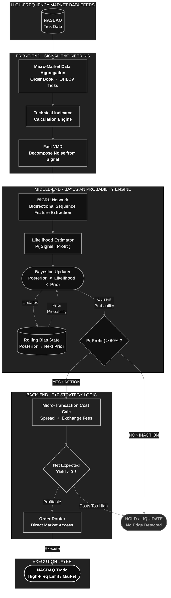
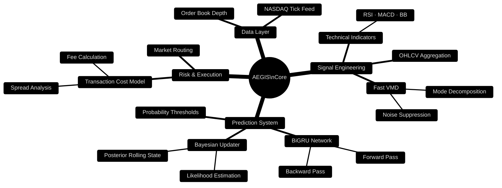
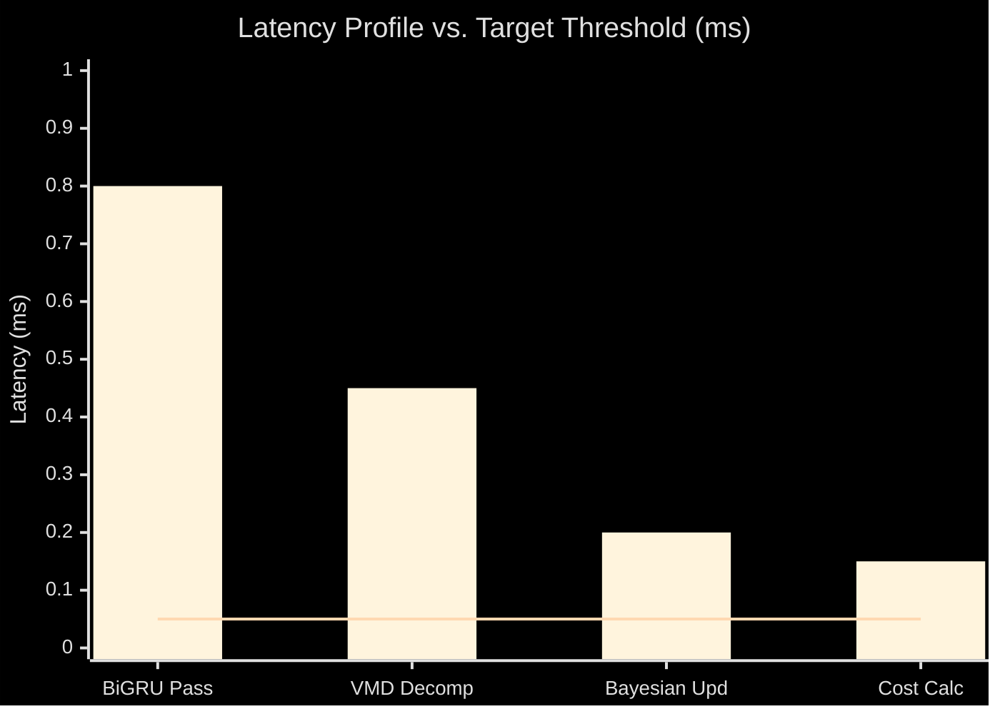
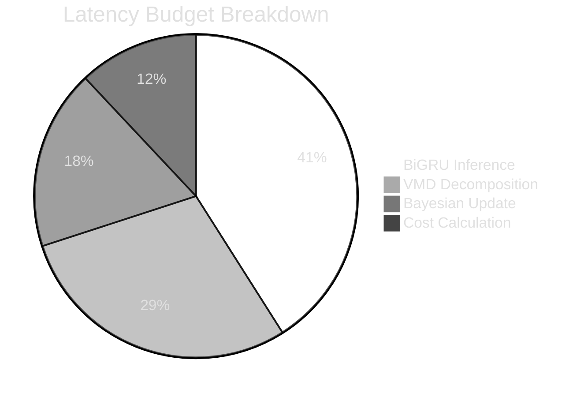
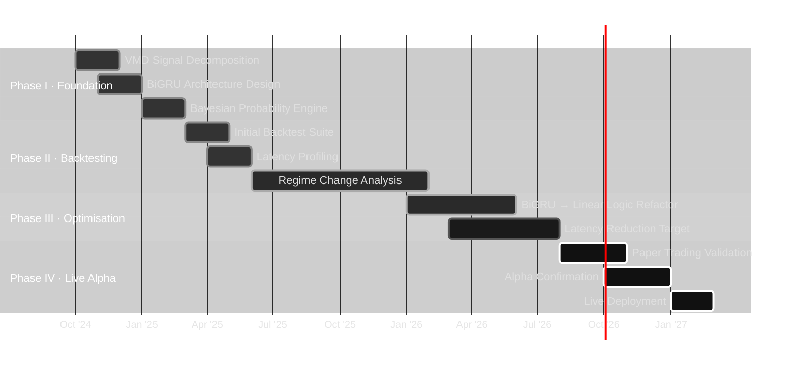

## System Architecture

---

## Component Breakdown

---

## Model Performance & Backtest Status

---

## Development Roadmap

---

## Research Notes

> **`[STATUS: PRE-ALPHA / NON-VIABLE]`**
>
> Current iteration fails strict HFT latency constraints. Backtesting indicates severe performance decay during structural regime shifts due to model adaptability drag. 
> 
> The primary bottleneck is deep learning inference overhead (`0.10–0.80ms`). To achieve true HFT execution bounds, the BiGRU model's feature extraction logic must be distilled and replicated via linearised logic approximations. Development is pivoting to optimise for microsecond-level execution.

---

**AEGIS**

