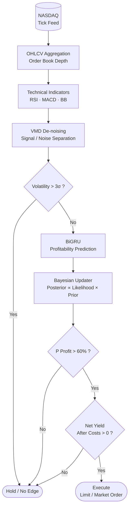
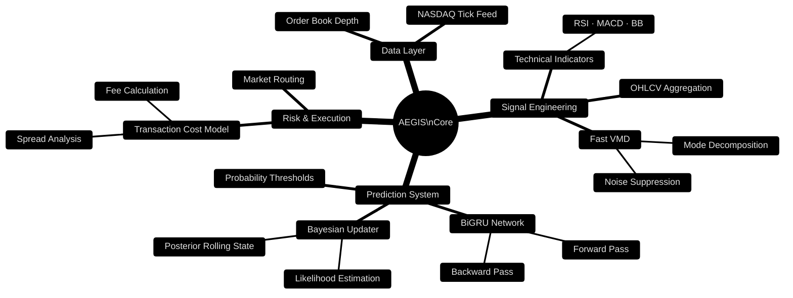
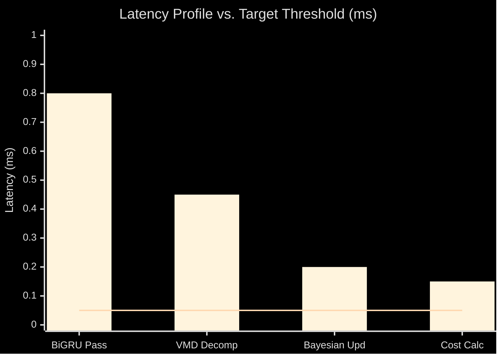
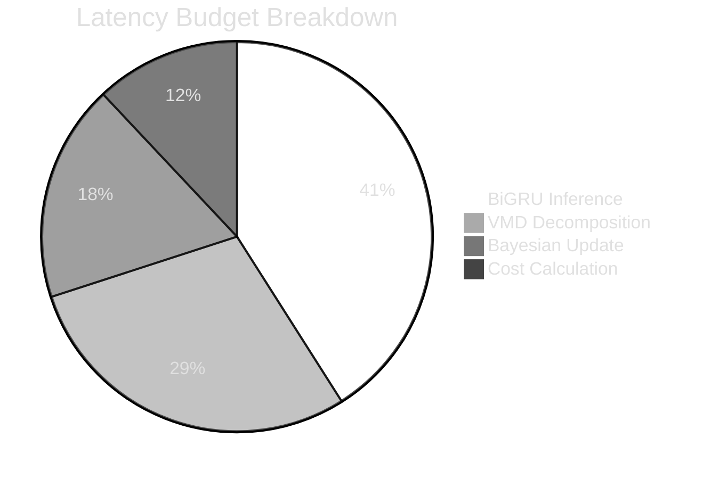
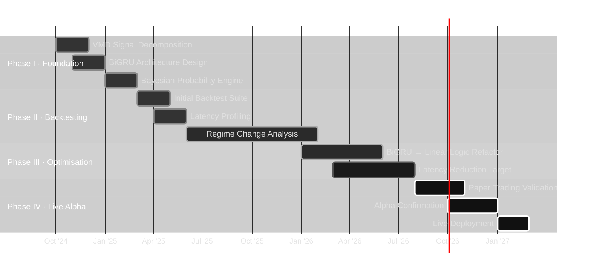

## What is Aegis?

---
Aegis is rather simple; implementation of base technicals; MACD, BB, RSI to create signals ("Signals" are simply the conventional 'breakouts' or 'bullish' intervals of all TIs, aggregated). Clean signals are passed through VMD decomposition to strip microstructure noise, then fed into Gemma 4 31B (no specialised fine-tuning) to estimate profitability, OHLVC is aggregated and simplified to variables through a scoring system [high - probability of profit (POP): 0.5<, Low - POP: 0-0.5, max: 1), the estimate is continously refined via a bayesian updater, execution is routed through Alpaca API and only proceeds if P(Profit) > 60% and net yield clears transaction costs.

---
## System Architecture

---

## Component Breakdown

---

## Model Performance & Backtest Status

---

## Development Roadmap

---

---

## Research Notes

> **`[STATUS: NON-VIABLE]`**

---

Raw tick data is decomposed via VMD minimisation to isolate tradeable signal components from market microstructure noise:

$$f(\alpha, \beta, \gamma) = \min_{k,\,\beta,\,\gamma} \{ \| \delta(t) - \sum_{k}^{n} u_k(t) \| + \alpha \| \partial_t [ u_k(t)\,e^{-i\omega_k t} ] \| \}$$

Extracts discrete sub-signals $u_k$ from raw input $\delta(t)$. The penalty term $\alpha$ regularises the derivative of each frequency-shifted mode, suppressing high-frequency noise without distorting the underlying signal structure.

---

Post-BiGRU, the system applies standard Bayesian inference over a rolling state:

$$\text{Posterior}(\theta \mid y) \;\propto\; P(y \mid \theta)\,P(\theta)$$

Each inference cycle maps the prior $P(\theta)$ against the likelihood of observed market data $P(y \mid \theta)$ to yield a continuous posterior distribution over signal validity. The posterior is recycled as the next prior, maintaining an adaptive belief state across time.

---

Two hard gates govern execution eligibility:

| Gate | Condition | Description |
|---|---|---|
| Volatility Filter | $\sigma_t \leq 3\sigma$ | Suspends execution during fat-tail regimes; no edge assumed beyond 3 standard deviations |
| Execution Gate | $\psi^* \xi > 0.6$ | Bayesian posterior $P(\text{Profit})$ must exceed 60% before order routing proceeds |

---

**Primary bottleneck:** Pronounced performance decay during structural regime shifts, Bayesian prior state exhibits adaptability drag under non-stationary volatility, causing posterior miscalibration. Regime change analysis ongoing.

  
---

## Sources

1. Cont, R. & Larrard, A. — *Dynamics of Order Positions and Related Queues in a Limit Order Book*
   https://www.researchgate.net/publication/277023747_Dynamics_of_Order_Positions_and_Related_Queues_in_a_Limit_Order_Book

2. Linux Kernel Documentation — *AF_XDP*
   https://docs.kernel.org/networking/af_xdp.html

3. DPDK — *Poll Mode Driver* (v24.03)
   https://doc.dpdk.org/guides-24.03/prog_guide/poll_mode_drv.html

4. DPDK — *OPDL Event Device* (v24.07)
   https://doc.dpdk.org/guides-24.07/eventdevs/opdl.html

5. DPDK — *ENA NIC Driver* (v25.03)
   https://doc.dpdk.org/guides-25.03/nics/ena.html

6. DPDK — *ICE NIC Driver* (v25.11)
   https://doc.dpdk.org/guides-25.11/nics/ice.html

7. DPDK Power Docs — *ENA NIC*
   https://dpdk-power-docs.readthedocs.io/en/latest/nics/ena.html

8. NVIDIA — *TensorRT Developer Guide*
   https://docs.nvidia.com/deeplearning/tensorrt/developer-guide/

9. AMD/Solarflare — *Enterprise Onload User Guide* (SF-104474-CD-34)
   https://www.amd.com/content/dam/amd/en/support/downloads/solarflare/onload/enterprise-onload/SF-104474-CD-34_Onload_User_Guide.pdf
